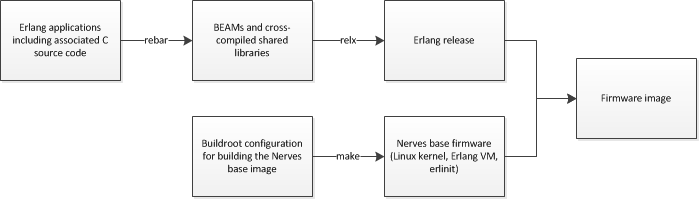

# Cross-compiled Erlang for Embedded Devices

Write your firmware using Erlang/OTP and popular Erlang build
tools like [Rebar](https://github.com/basho/rebar) and [Relx](http://relx.org/) in
a cross-compiled environment for targeting small to medium sized
embedded devices. Releases are packaged into bootable all-in-one firmware
images. [Buildroot](http://buildroot.net/) provides the base images and simplifies
cross-compilation of external C/C++ libraries needed for your application.

The Nerves project sets up your environment and provides the base images so that you
can do this:

The current target is the [BeagleBone Black](http://beagleboard.org/Products/BeagleBone%20Black).

## For C/C++ Embedded Software Developers

[Erlang](http://www.erlang.org/) provides a higher level programming
environment that has been used to build massively scalable soft
real-time systems with requirements on high availability (5-9's).
Erlang's runtime system has built-in support for concurrency, distribution
and fault tolerance.

It is quite common to interface with C and C++ code in Erlang to
handle performance critical or low level code or just to integrate
with existing libraries. Erlang can even supervise your C and C++
code so that crashes and failures can be handled and isolated
from the rest of your code.

The Nerves Project uses the Linux kernel to provide the devices drivers
needed for your embedded system. The kernel can be configured using
Buildroot to trim down the size of your firmware image if necessary.

Since so much of what the standard Linux userland provides can be
accomplished via Erlang libraries, very few userland tools are
actually needed. In fact, Nerves replaces _init_ with a small C
program that boots the Erlang runtime directly and lets Erlang
control initialization. The standard Erlang release tools ensure
that only the Erlang libraries that you need are included.

## For Erlang Developers

If you are able to develop on device, [Erlang Embedded](http://www.erlang-embedded.com/)
probably provides pre-built packages for your environment. If that's
not an option, the Nerves Project provides a cross-compiled environment
so that you don't have to give up Erlang.
